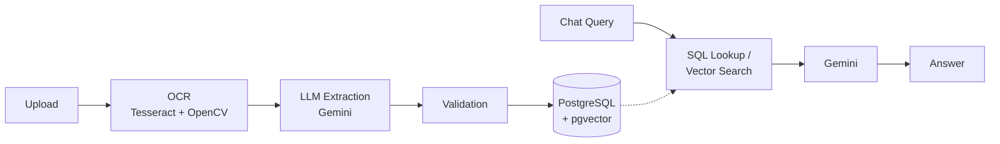

# Document Intelligence Platform

An AI-powered platform that extracts structured data from invoices and receipts using OCR and LLMs, and lets you ask natural-language questions across your uploaded documents using Retrieval-Augmented Generation (RAG).

**Live demo:** https://doc-intel-platform.onrender.com
*(Free-tier hosting — the app sleeps after ~15 minutes of inactivity, so the first load may take 30–60 seconds to wake up.)*

---

## What it does

1. **Upload** an invoice or receipt (image or PDF) — including real-world phone photos with handwriting, stamps, and awkward angles.
2. The platform **extracts** vendor details, GST/tax numbers, line items, quantities, and totals using OCR + an LLM.
3. The extraction is **self-validated**: line-item math (quantity × rate vs. taxable amount) is checked automatically, and mismatched lines are re-extracted or flagged for review.
4. **Ask questions** in plain English across one document or your whole document history — e.g. "What's the total of invoice 51109301?" or "List everything I bought from TechVision."

## How it works



- **OCR pipeline:** Tesseract + OpenCV, with automatic orientation correction (auto-detects and fixes sideways or upside-down phone photos before reading). Supports PNG, JPG, WEBP, BMP, TIFF, and multi-page PDFs (PDF text is read directly when available, with OCR as a fallback for scanned pages).
- **Extraction:** Google Gemini (via LangChain), given both the OCR text and the original image, extracts vendor name, seller/buyer GSTIN, document type, totals, dates, invoice numbers, and line items into a structured schema.
- **Validation:** For each line item, the system checks that quantity × rate matches the printed taxable amount (within tolerance). Mismatches trigger a focused re-extraction; lines that still don't check out are flagged for manual review instead of silently trusting a bad read.
- **Chat (RAG):** Questions about a specific document or invoice are answered directly from structured data in PostgreSQL. Open-ended questions ("what did I spend in total", broad searches) use vector similarity search over document embeddings (pgvector) with a diversity cap so one large document can't dominate the results. The system never fabricates a value — if a field wasn't extracted, it says so rather than guessing.
- **Resilience:** Automatic retries with backoff for transient LLM failures (503/timeout), friendly handling of rate-limit errors (429), and user-facing error messages that never expose raw stack traces or internal details.

## Tech stack

| Layer | Technology |
|---|---|
| Backend | FastAPI, Python |
| Database | PostgreSQL (Neon, serverless) + pgvector, SQLAlchemy, Alembic |
| OCR | Tesseract, OpenCV, PyMuPDF (PDF rendering) |
| LLM / RAG | Google Gemini, LangChain |
| Frontend | HTML / CSS / vanilla JS |
| Deployment | Docker, Render |

## Project structure

```
.
├── app/
│   ├── api/routes/         # FastAPI routes: documents, chat, health
│   └── static/             # Frontend (single-page HTML/CSS/JS)
├── db/
│   ├── models/              # SQLAlchemy models
│   ├── repositories/        # Query layer
│   └── migrations/          # Alembic migrations
├── pipeline/
│   └── extract/             # OCR, image preprocessing, field extraction, embeddings
├── scripts/                 # Backfill / maintenance scripts
├── tests/
├── Dockerfile
├── docker-compose.yml        # Local development only
└── requirements.txt
```

## Running locally

```bash
# 1. Clone and enter the project
git clone https://github.com/kunalpraja12/doc-intel-platform.git
cd doc-intel-platform

# 2. Create a virtual environment and install dependencies
python -m venv venv
venv\Scripts\activate        # Windows
pip install -r requirements.txt

# 3. Copy the environment template and fill in your own values
cp .env.example .env
# Set DATABASE_URL (a Postgres connection string, e.g. from Neon),
# GEMINI_API_KEY (from aistudio.google.com),
# and TESSERACT_CMD (path to your local Tesseract install)

# 4. Run database migrations
alembic -c db/alembic.ini upgrade head

# 5. Start the server
uvicorn app.main:app --reload --port 8000
```

Then open `http://127.0.0.1:8000`.

Tesseract OCR must be installed separately on your machine (not just the Python wrapper) — see [tesseract-ocr/tesseract](https://github.com/tesseract-ocr/tesseract) for install instructions per OS.

## Known limitations

- **Thermal receipts with dense price columns** sometimes fail OCR on the numeric columns — the system correctly returns `null` for unreadable fields rather than guessing.
- **Diagonal/stylized stamp graphics** (e.g. "PAID" ribbon stamps) are not reliably read by OCR; this was tested and intentionally not pursued further, as it added processing time without improving accuracy.
- **Multi-page documents**: if a document continues onto a page that wasn't uploaded (e.g. the bill total prints on page 2), the total will correctly show as not identified rather than a guessed value.
- **Free-tier hosting**: the live demo sleeps after inactivity (first load can take up to a minute), and broad questions across a large document history can hit the Gemini free-tier rate limit — the system handles this gracefully with a friendly message and automatic retry rather than failing silently.
- **Raw uploaded files are not persisted across deploys** on the free tier (no attached object storage); extracted data (OCR text, structured fields, embeddings) is safely stored in PostgreSQL regardless.

## What this project demonstrates

- End-to-end AI pipeline design: OCR → LLM extraction → validation → storage → retrieval
- Multimodal LLM usage (image + text) for extracting data from messy real-world documents
- RAG system design, including hybrid retrieval (structured SQL vs. vector search) and hallucination prevention
- Production concerns often skipped in portfolio projects: API rate-limit handling, retry logic, duplicate detection, error handling that doesn't leak internals, and containerized cloud deployment
